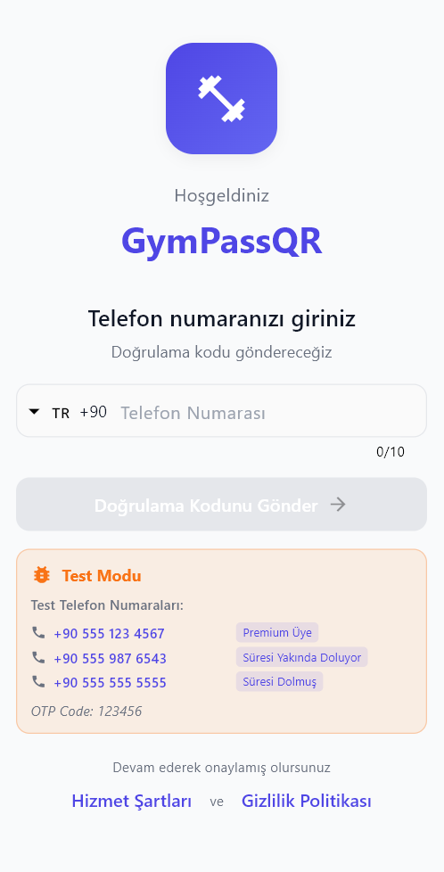
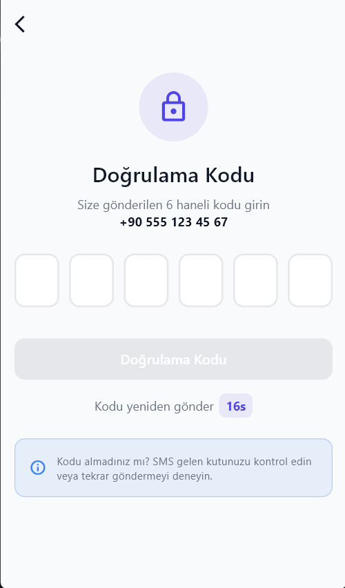
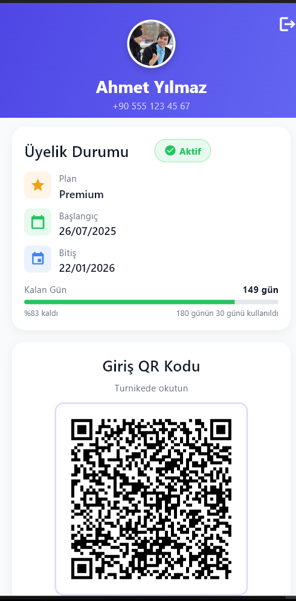
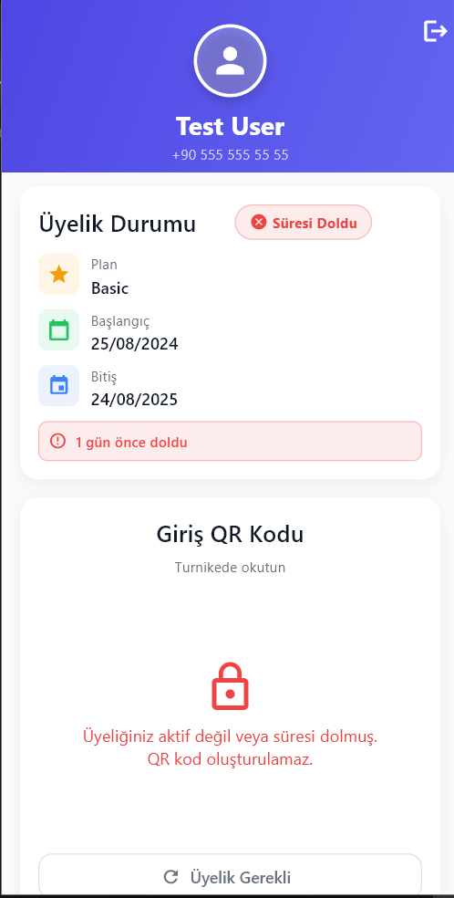

# 💪 GymPass QR - Digital Gym Access System

[](https://flutter.dev)
[](https://dart.dev)
[](LICENSE)
[](https://flutter.dev)

A modern mobile application that replaces physical gym membership cards with secure QR codes. Members can access gym facilities by simply showing a QR code on their phone.

## 📱 Screenshots

<table>
  <tr>
    <th>Phone Input</th>
    <th>OTP Verification</th>
    <th>Home Screen (Active)</th>
    <th>Home Screen (Inactive)</th>
  </tr>
  <tr>
    <td align="center"></td>
    <td align="center"></td>
    <td align="center"></td>
    <td align="center"></td>
  </tr>
</table>

## ✨ Features

- 📲 **One-time SMS Authentication** - Login once, stay logged in for 30 days
- 🔐 **Secure Token Management** - Encrypted storage with automatic refresh
- 📷 **Dynamic QR Codes** - Auto-refreshing every 5 minutes for security
- 📊 **Membership Tracking** - See your membership status and expiry date
- 🌐 **Offline Support** - QR codes work without internet connection
- 🎨 **Beautiful UI** - Modern, clean interface with smooth animations
- 🔄 **Auto-Login** - No need to login every time you open the app

## 🚀 Quick Start

### Prerequisites

- Flutter SDK (3.x or higher)
- Dart SDK (3.0 or higher)
- Android Studio / VS Code
- iOS: Xcode 14+ and CocoaPods
- Android: Android Studio and Android SDK

### Installation

1. **Clone the repository**

```bash
git clone https://github.com/your-company/gympass-qr.git
cd gympass-qr
```

2. **Install dependencies**

```bash
flutter pub get
```

3. **Run the app**

```bash
# For development with hot reload
flutter run

# For specific device
flutter run -d device_id

# List available devices
flutter devices
```

## 🧪 Testing

### Test Accounts (Mock Mode)

The app comes with built-in test accounts for development:

| Phone Number | User Type | Description | Test OTP |
|-------------|-----------|-------------|----------|
| `+90 555 123 4567` | Premium | Active membership (150 days) | `123456` |
| `+90 555 987 6543` | Standard | Expiring soon (5 days) | `123456` |
| `+90 555 555 5555` | Basic | Expired membership | `123456` |

### How to Test

1. **Run the app** in debug mode
2. **Click on any test number** in the phone input screen (they're clickable!)
3. **Use OTP:** `123456` for all test accounts
4. **Test persistence:** Login → Close app → Reopen (should skip login)
5. **Test logout:** Click logout → Confirm → Returns to login

## 🔧 Configuration

### Switch Between Mock and Real API

Edit `lib/config/constants.dart`:

```dart
// For DEVELOPMENT (Mock Data)
static const bool useMockData = true;
static const String baseUrl = 'mock://api';

// For PRODUCTION (Real API)
static const bool useMockData = false;
static const String baseUrl = 'https://api.gympass.com/v1';
```

### API Endpoints Configuration

If your API endpoints are different, update them in `constants.dart`:

```dart
static const String sendOtpEndpoint = '/auth/send-otp';
static const String verifyOtpEndpoint = '/auth/verify-otp';
static const String getUserProfileEndpoint = '/user/profile';
static const String refreshTokenEndpoint = '/auth/refresh';
static const String generateQrEndpoint = '/user/generate-qr';
```

### Environment Variables

Create different configs for each environment:

```dart
// lib/config/dev_config.dart
class DevConfig {
  static const String baseUrl = 'https://dev-api.gympass.com';
  static const bool enableLogging = true;
}

// lib/config/prod_config.dart
class ProdConfig {
  static const String baseUrl = 'https://api.gympass.com';
  static const bool enableLogging = false;
}
```

## 📁 Project Structure

```
lib/
├── main.dart                 # App entry point
├── app.dart                  # App configuration
│
├── config/                   # Configuration files
│   ├── constants.dart        # App-wide constants
│   ├── routes.dart          # Navigation routing
│   └── theme.dart           # UI theme and styling
│
├── models/                   # Data models
│   ├── user_model.dart      # User data structure
│   ├── auth_model.dart      # Authentication models
│   └── qr_model.dart        # QR code model
│
├── services/                 # Business logic
│   ├── api_service.dart     # API communication (Dio)
│   ├── auth_service.dart    # Authentication logic
│   ├── storage_service.dart # Secure local storage
│   └── qr_service.dart      # QR code generation
│
├── providers/                # State management (Provider)
│   ├── auth_provider.dart   # Authentication state
│   └── user_provider.dart   # User and QR state
│
├── screens/                  # UI screens
│   ├── splash/              # Splash screen
│   │   └── splash_screen.dart
│   ├── auth/                # Authentication screens
│   │   ├── phone_input_screen.dart
│   │   └── otp_verification_screen.dart
│   └── home/                # Main screen
│       └── home_screen.dart
│
├── widgets/                  # Reusable UI components
│   └── common/              
│       ├── custom_button.dart
│       └── loading_overlay.dart
│
├── utils/                    # Helper utilities
│   ├── validators.dart      # Input validation
│   └── logger.dart          # Debug logging
│
└── mock/                     # Mock data for testing
    └── mock_data_service.dart
```

## 🔌 API Integration

### Expected API Response Formats

Your backend should return data in these formats:

#### Send OTP Response

```json
{
  "success": true,
  "message": "OTP sent successfully"
}
```

#### Verify OTP Response

```json
{
  "accessToken": "eyJhbGciOiJIUzI1NiIs...",
  "refreshToken": "eyJhbGciOiJIUzI1NiIs...",
  "expiresIn": 2592000,
  "user": {
    "id": "user_001",
    "firstName": "Ahmet",
    "lastName": "Yılmaz",
    "phoneNumber": "+905551234567",
    "profilePhotoUrl": "https://example.com/photo.jpg",
    "membershipStart": "2024-01-01",
    "membershipEnd": "2024-07-01",
    "membershipType": "Premium",
    "isActive": true
  }
}
```

#### Generate QR Response

```json
{
  "userId": "user_001",
  "token": "qr_token_abc123",
  "validUntil": "2024-01-15T14:30:00Z",
  "metadata": {
    "gymId": "gym_001",
    "location": "Main Branch"
  }
}
```

## 🏗️ Building for Production

### Android

1. **Update version** in `pubspec.yaml`:

```yaml
version: 1.0.0+1  # Increment for each release
```

2. **Build APK**:

```bash
flutter build apk --release

# Output: build/app/outputs/flutter-apk/app-release.apk
```

3. **Build App Bundle** (for Play Store):

```bash
flutter build appbundle --release

# Output: build/app/outputs/bundle/release/app-release.aab
```

### iOS

1. **Update version** in Xcode or `pubspec.yaml`

2. **Build for iOS**:

```bash
flutter build ios --release

# Then open Xcode and archive
open ios/Runner.xcworkspace
```

3. **Archive and upload** through Xcode

## 🐛 Debugging

### Enable Debug Logs

```dart
// In lib/utils/logger.dart
AppLogger.debug('Your debug message');
AppLogger.info('Info message');
AppLogger.error('Error message', error);
```

### Common Issues & Solutions

| Issue | Solution |
|-------|----------|
| **Can't receive OTP** | Check phone number format (+90 prefix for Turkey) |
| **Token expired error** | Logout and login again |
| **QR not generating** | Check internet connection and API status |
| **Build fails** | Run `flutter clean` then `flutter pub get` |
| **iOS build fails** | Run `cd ios && pod install` |

### View Logs

```bash
# View all logs
flutter logs

# Filter logs
flutter logs | grep "QR"
```

## 📦 Dependencies

```yaml
dependencies:
  flutter:
    sdk: flutter
    
  # State Management
  provider: ^6.1.1
  
  # Networking
  dio: ^5.4.0
  pretty_dio_logger: ^1.3.1
  connectivity_plus: ^5.0.2
  
  # Storage
  flutter_secure_storage: ^9.0.0
  shared_preferences: ^2.2.2
  
  # UI Components
  qr_flutter: ^4.1.0
  pin_code_fields: ^8.0.1
  intl_phone_field: ^3.2.0
  flutter_spinkit: ^5.2.0
  cached_network_image: ^3.3.1
  
  # Navigation
  go_router: ^13.0.0
  
  # Utilities
  logger: ^2.0.2
  intl: ^0.18.1
  equatable: ^2.0.5
```

## 🔄 State Management

The app uses **Provider** for state management:

- **AuthProvider**: Manages authentication state, tokens, and login flow
- **UserProvider**: Manages user data, QR codes, and membership info

Example usage:

```dart
// Read state
final authProvider = context.read<AuthProvider>();

// Watch for changes
final user = context.watch<UserProvider>().user;

// Call methods
await authProvider.sendOtp(phoneNumber);
```

## 🛡️ Security

- ✅ **Encrypted Storage**: Tokens stored using platform-specific encryption
- ✅ **HTTPS Only**: All API calls over secure connection
- ✅ **Token Expiry**: Automatic token refresh before expiry
- ✅ **OTP Rate Limiting**: 3 attempts per 30 minutes
- ✅ **QR Rotation**: QR codes refresh every 5 minutes
- ✅ **No Sensitive Logs**: No passwords or tokens in debug logs

## 🤝 Contributing

1. Fork the repository
2. Create your feature branch (`git checkout -b feature/AmazingFeature`)
3. Commit your changes (`git commit -m 'Add some AmazingFeature'`)
4. Push to the branch (`git push origin feature/AmazingFeature`)
5. Open a Pull Request

### Coding Standards

- Follow [Flutter style guide](https://flutter.dev/docs/development/tools/formatting)
- Add comments for complex logic
- Write unit tests for new features
- Update documentation for API changes

## 📝 License

This project is proprietary and confidential. All rights reserved.

## 👥 Team

- **Project Manager**: [Name]
- **Mobile Developer**: [Name]
- **Backend Developer**: [Name]
- **UI/UX Designer**: [Name]

## 📞 Support

For support, email <support@gympass.com> or create an issue in the repository.

## 🚦 Project Status


- ✅ SMS Authentication
- ✅ QR Code Generation
- ✅ Token Persistence
- ✅ Auto-refresh
- ✅ Offline Support
- 🔄 Biometric Login (Coming Soon)
- 🔄 Multiple Gym Support (Coming Soon)
- 🔄 Guest Pass Feature (Coming Soon)

## 📊 Performance

- **App Size**: ~15 MB (Android), ~25 MB (iOS)
- **Startup Time**: < 2 seconds
- **QR Generation**: < 100ms
- **API Response**: < 200ms average
- **Token Refresh**: Automatic, seamless

## 🔗 Useful Links

- [Flutter Documentation](https://flutter.dev/docs)
- [Provider Package](https://pub.dev/packages/provider)
- [Dio Package](https://pub.dev/packages/dio)
- [QR Flutter](https://pub.dev/packages/qr_flutter)

---

## 🎯 Quick Commands Reference

```bash
# Development
flutter run                      # Run in debug mode
flutter run --release           # Run in release mode
flutter run --profile           # Run in profile mode

# Testing
flutter test                     # Run all tests
flutter test test/widget_test.dart  # Run specific test

# Building
flutter build apk               # Build Android APK
flutter build ios               # Build iOS
flutter build appbundle         # Build for Play Store

# Cleaning
flutter clean                   # Clean build files
flutter pub cache clean         # Clean pub cache

# Dependencies
flutter pub get                 # Get dependencies
flutter pub upgrade             # Upgrade dependencies
flutter pub outdated            # Check outdated packages

# Code Generation
flutter pub run build_runner build  # Run code generation

# Formatting
flutter format .                # Format all Dart files
flutter analyze                 # Analyze code
```

---

**Made with ❤️ by the GymPass Team**

*Last Updated: January 2025*
