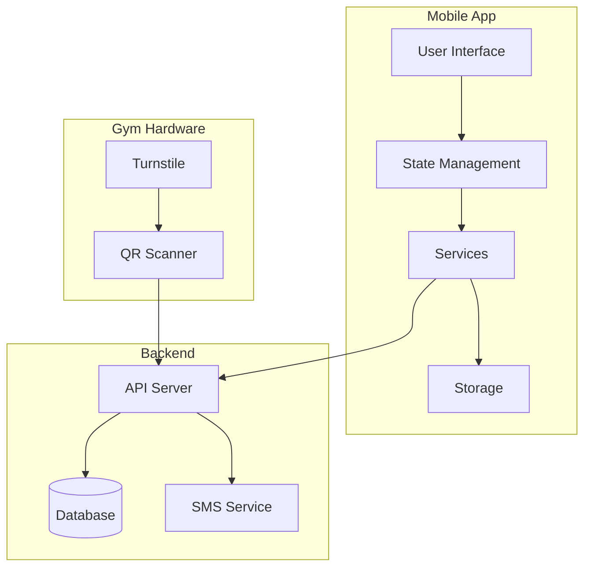
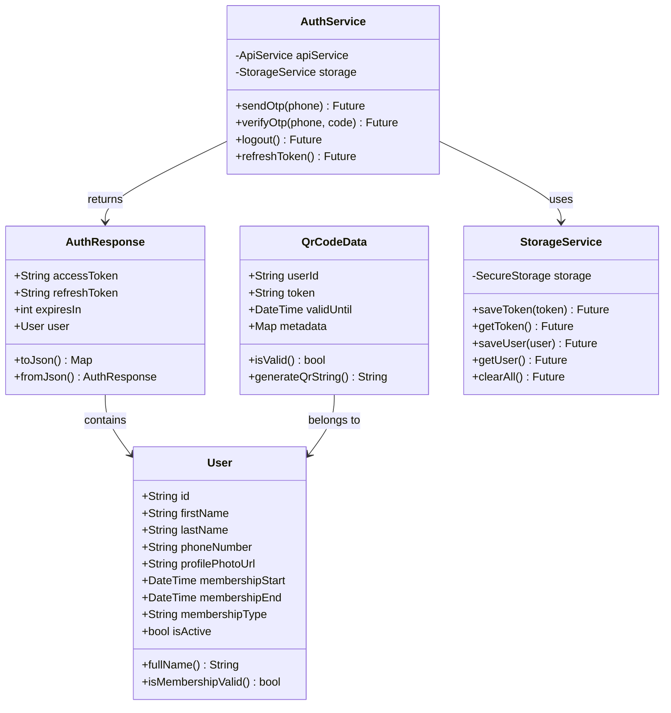
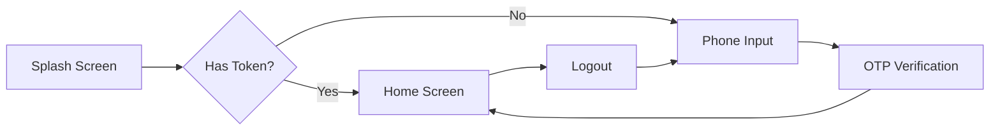
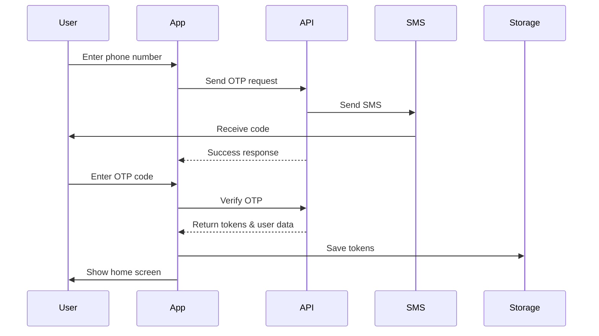
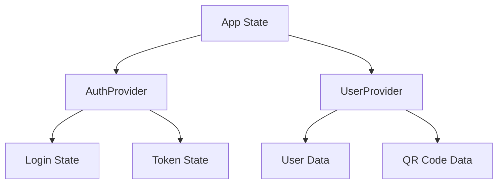
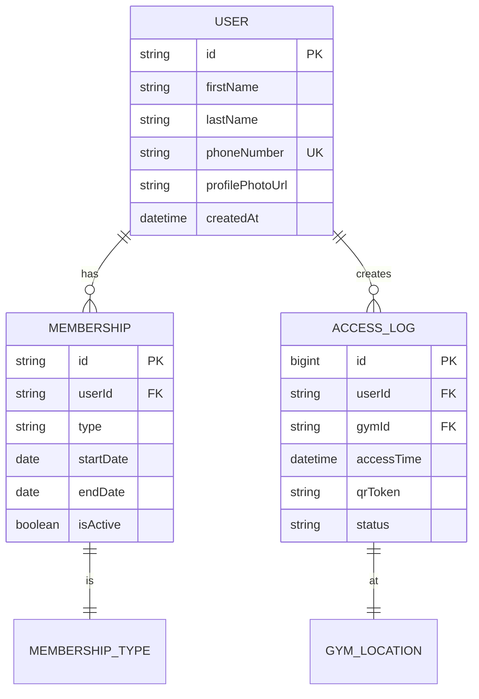
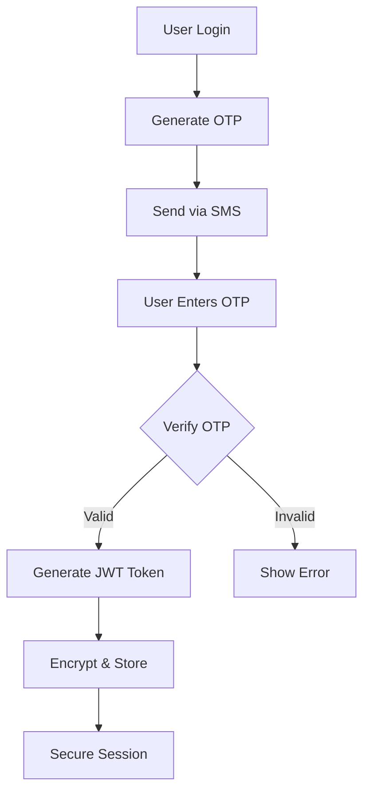

# GymPass QR System - Technical Documentation

**Version:** 1.0.0  
**Date:** January 2025  
**Document Type:** Technical Handover Documentation  
**Language:** English

---

## Table of Contents

1. [Project Overview](#1-project-overview)
2. [System Architecture](#2-system-architecture)
3. [Project Structure](#3-project-structure)
4. [Data Models](#4-data-models)
5. [Core Services](#5-core-services)
6. [User Interface Screens](#6-user-interface-screens)
7. [Authentication Flow](#7-authentication-flow)
8. [State Management](#8-state-management)
9. [API Integration](#9-api-integration)
10. [Database Design](#10-database-design)
11. [Security Implementation](#11-security-implementation)
12. [Testing Guide](#12-testing-guide)
13. [Deployment Instructions](#13-deployment-instructions)
14. [Troubleshooting](#14-troubleshooting)
15. [Future Development](#15-future-development)

---

## 1. Project Overview

### 1.1 What is GymPass QR?

GymPass QR is a mobile application that allows gym members to enter the facility using QR codes on their phones. Instead of carrying physical membership cards, users can simply show a QR code on their phone screen to the scanner at the gym entrance.

### 1.2 How Does It Work?

1. **User opens the app** on their phone
2. **Enters phone number** (first time only)
3. **Receives SMS code** for verification
4. **Enters the code** to login
5. **Sees QR code** on home screen
6. **Shows QR code** to scanner at gym
7. **Gains entry** to the facility

### 1.3 Key Features

- **One-time login:** Users don't need to login every time
- **Automatic QR refresh:** QR codes update every 5 minutes
- **Offline support:** QR codes work even without internet
- **Membership tracking:** Shows membership expiry date
- **Secure:** Uses encrypted tokens and secure storage

### 1.4 Technology Stack

| Component | Technology | Purpose |
|-----------|------------|---------|
| Mobile App | Flutter | Cross-platform development |
| Language | Dart | Programming language for Flutter |
| State Management | Provider | Managing app state |
| HTTP Client | Dio | API communication |
| Storage | Flutter Secure Storage | Storing tokens securely |
| QR Generation | qr_flutter | Creating QR codes |

---

## 2. System Architecture

### 2.1 High-Level Architecture Diagram



### 2.2 Component Responsibilities

**Mobile App Components:**
- **UI Layer:** Displays screens to user
- **State Management:** Manages data flow in app
- **Services:** Handles business logic
- **Storage:** Saves data locally on phone

**Backend Components:**
- **API Server:** Processes requests from app
- **Database:** Stores user information
- **SMS Service:** Sends verification codes

**Hardware Components:**
- **QR Scanner:** Reads QR codes
- **Turnstile:** Physical gate at gym entrance

---

## 3. Project Structure

### 3.1 Folder Organization

```
gym_pass_qr/
├── lib/                      # Main code directory
│   ├── main.dart            # App entry point
│   ├── app.dart             # App configuration
│   │
│   ├── config/              # Configuration files
│   │   ├── constants.dart   # App constants
│   │   ├── routes.dart      # Navigation routes
│   │   └── theme.dart       # UI theme
│   │
│   ├── models/              # Data models
│   │   ├── user_model.dart  # User data structure
│   │   └── auth_model.dart  # Authentication data
│   │
│   ├── services/            # Business logic
│   │   ├── api_service.dart # API communication
│   │   ├── auth_service.dart # Authentication
│   │   └── storage_service.dart # Local storage
│   │
│   ├── providers/           # State management
│   │   ├── auth_provider.dart # Auth state
│   │   └── user_provider.dart # User state
│   │
│   ├── screens/             # UI screens
│   │   ├── splash/          # Loading screen
│   │   ├── auth/            # Login screens
│   │   └── home/            # Main screen
│   │
│   ├── widgets/             # Reusable UI components
│   │   └── common/          # Shared widgets
│   │
│   ├── utils/               # Helper functions
│   │   ├── validators.dart  # Input validation
│   │   └── logger.dart      # Logging utility
│   │
│   └── mock/                # Test data
│       └── mock_data_service.dart # Fake API
│
├── assets/                  # Images, fonts, etc.
├── android/                 # Android-specific code
├── ios/                     # iOS-specific code
└── pubspec.yaml            # Dependencies
```

### 3.2 File Purposes

Each folder has a specific purpose:

- **config/**: Settings that control the app
- **models/**: Define what data looks like
- **services/**: Handle complex operations
- **providers/**: Manage app state
- **screens/**: What users see
- **widgets/**: Reusable UI pieces
- **utils/**: Helper tools
- **mock/**: Fake data for testing

---

## 4. Data Models

### 4.1 User Model

```dart
class User {
  String id;              // Unique identifier
  String firstName;       // User's first name
  String lastName;        // User's last name
  String phoneNumber;     // Phone for login
  String? profilePhotoUrl; // Optional photo
  DateTime membershipStart; // When membership began
  DateTime membershipEnd;   // When membership expires
  String membershipType;    // Basic/Standard/Premium
  bool isActive;           // Account status
}
```

### 4.2 Authentication Model

```dart
class AuthResponse {
  String accessToken;    // Token for API calls
  String refreshToken;   // Token to get new access token
  int expiresIn;        // Seconds until expiry
  User user;            // User information
}
```

### 4.3 QR Code Model

```dart
class QrCodeData {
  String userId;         // Which user
  String token;          // Unique QR token
  DateTime validUntil;   // When QR expires
  Map metadata;          // Extra information
}
```

### 4.4 UML Class Diagram



---

## 5. Core Services

### 5.1 Authentication Service

**Purpose:** Handles all login-related operations

**Main Functions:**
- `sendOtp(phoneNumber)`: Sends SMS code
- `verifyOtp(phoneNumber, code)`: Checks if code is correct
- `logout()`: Clears user session
- `refreshToken()`: Gets new token when expired

**How it works:**
1. User enters phone number
2. Service sends request to API
3. API sends SMS to user
4. User enters code
5. Service verifies code
6. If correct, saves token and user data

### 5.2 Storage Service

**Purpose:** Saves data on the phone

**Main Functions:**
- `saveToken(token)`: Stores login token
- `getToken()`: Retrieves stored token
- `saveUser(user)`: Stores user information
- `clearAll()`: Deletes all stored data

**Security:** Uses encrypted storage for sensitive data

### 5.3 API Service

**Purpose:** Communicates with backend server

**Main Functions:**
- `get(endpoint)`: Fetches data
- `post(endpoint, data)`: Sends data
- Automatic token attachment
- Error handling
- Retry logic

---

## 6. User Interface Screens

### 6.1 Screen Flow Diagram



### 6.2 Screen Descriptions

#### Splash Screen
- **Purpose:** Loading screen while app starts
- **Duration:** 2 seconds
- **Actions:** Checks if user is already logged in

#### Phone Input Screen
- **Purpose:** User enters phone number
- **Validation:** Checks phone format
- **Next:** Sends OTP and goes to verification

#### OTP Verification Screen
- **Purpose:** User enters SMS code
- **Features:** 
  - 30-second resend timer
  - 6-digit code input
  - Auto-submit when complete

#### Home Screen
- **Purpose:** Shows QR code and user info
- **Features:**
  - User profile display
  - Membership status
  - QR code for scanning
  - Refresh button
  - Logout option

---

## 7. Authentication Flow

### 7.1 Sequence Diagram



### 7.2 Token Management

**Token Types:**
1. **Access Token:** Used for API calls (expires in 1 hour)
2. **Refresh Token:** Used to get new access token (expires in 30 days)

**Token Flow:**
1. User logs in → Gets both tokens
2. Access token expires → Use refresh token
3. Refresh token expires → User must login again

---

## 8. State Management

### 8.1 Provider Pattern

The app uses Provider for state management:



### 8.2 State Updates

**AuthProvider manages:**
- Login status
- Authentication tokens
- Loading states
- Error messages

**UserProvider manages:**
- User profile data
- QR code generation
- Membership information

---

## 9. API Integration

### 9.1 API Endpoints

| Method | Endpoint | Purpose | Authentication |
|--------|----------|---------|----------------|
| POST | `/auth/send-otp` | Send SMS code | No |
| POST | `/auth/verify-otp` | Verify code | No |
| GET | `/user/profile` | Get user info | Yes |
| POST | `/user/generate-qr` | Create QR code | Yes |
| POST | `/auth/refresh` | Refresh token | Yes |

### 9.2 Request/Response Format

**Send OTP Request:**
```json
{
  "phoneNumber": "+905551234567"
}
```

**Send OTP Response:**
```json
{
  "success": true,
  "message": "OTP sent successfully"
}
```

**Verify OTP Request:**
```json
{
  "phoneNumber": "+905551234567",
  "code": "123456"
}
```

**Verify OTP Response:**
```json
{
  "accessToken": "eyJhbGciOiJIUzI1NiIs...",
  "refreshToken": "eyJhbGciOiJIUzI1NiIs...",
  "expiresIn": 3600,
  "user": {
    "id": "user_001",
    "firstName": "John",
    "lastName": "Doe",
    "membershipEnd": "2024-12-31"
  }
}
```

### 9.3 Error Handling

**Common Error Codes:**
- `400`: Bad request (invalid data)
- `401`: Unauthorized (token expired)
- `404`: Not found (user doesn't exist)
- `500`: Server error

---

## 10. Database Design

### 10.1 Entity Relationship Diagram



### 10.2 Tables Description

**Users Table:**
- Stores basic user information
- Phone number is unique identifier
- Links to membership and access logs

**Memberships Table:**
- Tracks membership periods
- Can have multiple entries per user
- Only one active at a time

**Access Logs Table:**
- Records every entry attempt
- Used for analytics and security
- Helps track usage patterns

---

## 11. Security Implementation

### 11.1 Security Measures

1. **Token Security:**
   - Tokens stored in encrypted storage
   - Automatic expiry and refresh
   - Secure transmission over HTTPS

2. **OTP Security:**
   - 6-digit random codes
   - 5-minute expiry
   - Rate limiting (3 attempts)

3. **Data Protection:**
   - AES-256 encryption for storage
   - TLS 1.3 for network communication
   - No sensitive data in logs

### 11.2 Security Flow Diagram



---

## 12. Testing Guide

### 12.1 Test Accounts

For testing, use these phone numbers:

| Phone Number | User Type | Description |
|--------------|-----------|-------------|
| +90 555 123 4567 | Premium | Active membership |
| +90 555 987 6543 | Standard | Expiring soon |
| +90 555 555 5555 | Basic | Expired membership |

**Test OTP Code:** `123456` (works for all test accounts)

### 12.2 Testing Scenarios

1. **New User Login:**
   - Enter phone number
   - Enter OTP
   - Verify home screen appears

2. **Token Persistence:**
   - Login once
   - Close app
   - Reopen app
   - Should go directly to home

3. **QR Generation:**
   - Go to home screen
   - Verify QR code appears
   - Check refresh works

4. **Logout:**
   - Click logout button
   - Confirm action
   - Verify return to login

### 12.3 Mock Mode vs Real API

**Current Setup (Mock Mode):**
```dart
static const bool useMockData = true;
```

**To Use Real API:**
```dart
static const bool useMockData = false;
static const String baseUrl = 'https://your-api.com';
```

---

## 13. Deployment Instructions

### 13.1 Android Deployment

1. **Update version** in `pubspec.yaml`:
   ```yaml
   version: 1.0.0+1
   ```

2. **Build APK:**
   ```bash
   flutter build apk --release
   ```

3. **Build App Bundle:**
   ```bash
   flutter build appbundle --release
   ```

4. **Output location:**
   - APK: `build/app/outputs/flutter-apk/app-release.apk`
   - Bundle: `build/app/outputs/bundle/release/app-release.aab`

### 13.2 iOS Deployment

1. **Open in Xcode:**
   ```bash
   open ios/Runner.xcworkspace
   ```

2. **Configure signing:**
   - Select team
   - Set bundle identifier

3. **Build archive:**
   ```bash
   flutter build ios --release
   ```

4. **Upload to App Store:**
   - Use Xcode organizer
   - Or use Transporter app

### 13.3 Environment Configuration

**Development:**
```dart
class DevConfig {
  static const String baseUrl = 'https://dev-api.com';
  static const bool enableLogging = true;
}
```

**Production:**
```dart
class ProdConfig {
  static const String baseUrl = 'https://api.com';
  static const bool enableLogging = false;
}
```

---

## 14. Troubleshooting

### 14.1 Common Issues

| Problem | Cause | Solution |
|---------|-------|----------|
| App crashes on start | Missing dependencies | Run `flutter pub get` |
| Can't receive OTP | Wrong phone format | Check country code |
| QR not generating | API error | Check internet connection |
| Token expired error | Old token | Logout and login again |
| Build fails | Old Flutter version | Run `flutter upgrade` |

### 14.2 Debug Tips

1. **Enable logging:**
   ```dart
   AppLogger.debug('Your message here');
   ```

2. **Check API responses:**
   - Use Dio interceptor
   - Log all requests/responses

3. **Test offline:**
   - Turn off internet
   - Check error handling

### 14.3 Error Messages

**User-Friendly Messages:**
- "Something went wrong" → Check logs for details
- "Network error" → No internet connection
- "Session expired" → Token needs refresh
- "Invalid code" → Wrong OTP entered

---

## 15. Future Development

### 15.1 Planned Features

1. **Biometric Login:**
   - Fingerprint authentication
   - Face ID support

2. **Multiple Gyms:**
   - Select gym location
   - Different QR per location

3. **Guest Passes:**
   - Generate temporary QR
   - Share with friends

4. **Payment Integration:**
   - Renew membership in-app
   - Payment history

5. **Analytics Dashboard:**
   - Visit frequency
   - Peak hours
   - Usage statistics

### 15.2 Code Improvements

1. **Add Unit Tests:**
   ```dart
   test('User model parsing', () {
     final user = User.fromJson(jsonData);
     expect(user.firstName, 'John');
   });
   ```

2. **Implement Caching:**
   - Cache user data
   - Offline QR generation

3. **Add Animations:**
   - Screen transitions
   - QR code animations

4. **Improve Error Handling:**
   - Specific error types
   - Recovery mechanisms

### 15.3 Performance Optimizations

1. **Reduce API Calls:**
   - Cache responses
   - Batch requests

2. **Optimize Images:**
   - Use WebP format
   - Lazy loading

3. **Code Splitting:**
   - Dynamic imports
   - Reduce initial load

---

## Appendix A: Dependencies

```yaml
dependencies:
  flutter:
    sdk: flutter
  provider: ^6.1.1          # State management
  dio: ^5.4.0              # HTTP client
  flutter_secure_storage: ^9.0.0  # Secure storage
  shared_preferences: ^2.2.2       # Regular storage
  qr_flutter: ^4.1.0       # QR generation
  go_router: ^13.0.0       # Navigation
  pin_code_fields: ^8.0.1 # OTP input
  intl_phone_field: ^3.2.0 # Phone input
```

## Appendix B: Project Commands

```bash
# Install dependencies
flutter pub get

# Run app
flutter run

# Run on specific device
flutter run -d device_id

# Build APK
flutter build apk

# Clean project
flutter clean

# Update dependencies
flutter pub upgrade

# Generate icons
flutter pub run flutter_launcher_icons:main

# Run tests
flutter test
```

## Appendix C: Contact Information

**Development Team:**
- Project Lead: [Name]
- Mobile Developer: [Name]
- Backend Developer: [Name]

**Support:**
- Email: support@gympass.com
- Documentation: This document
- Repository: [Git URL]

---

**Document Version History:**
- v1.0.0 (Jan 2025): Initial documentation

**End of Document**