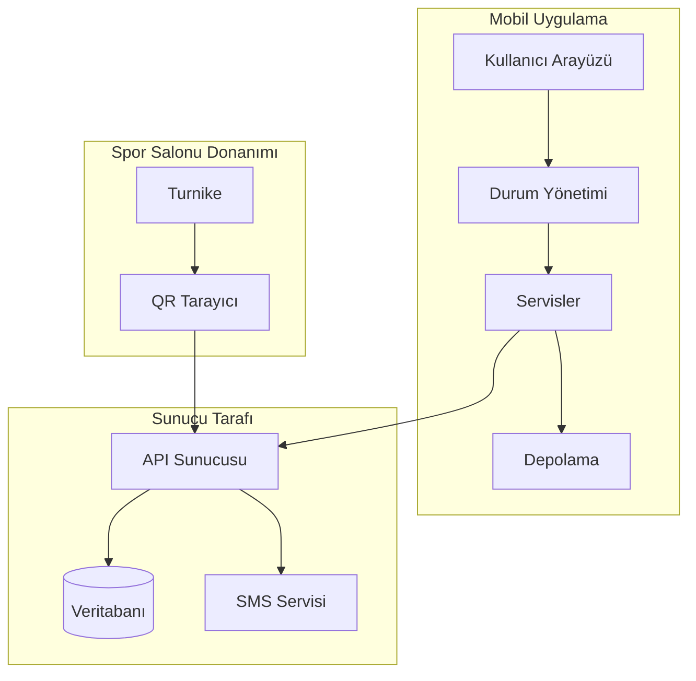
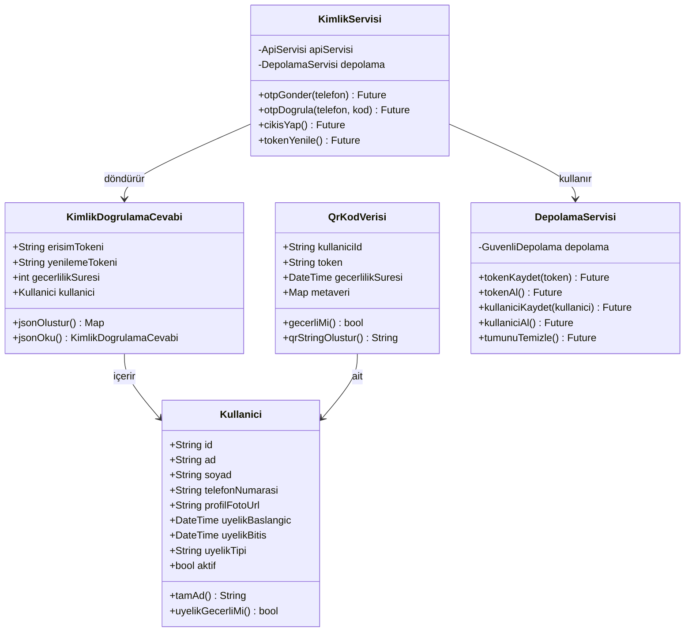
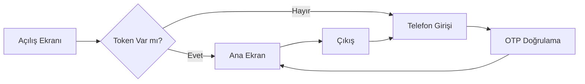
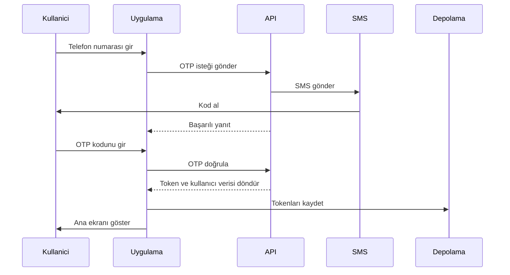
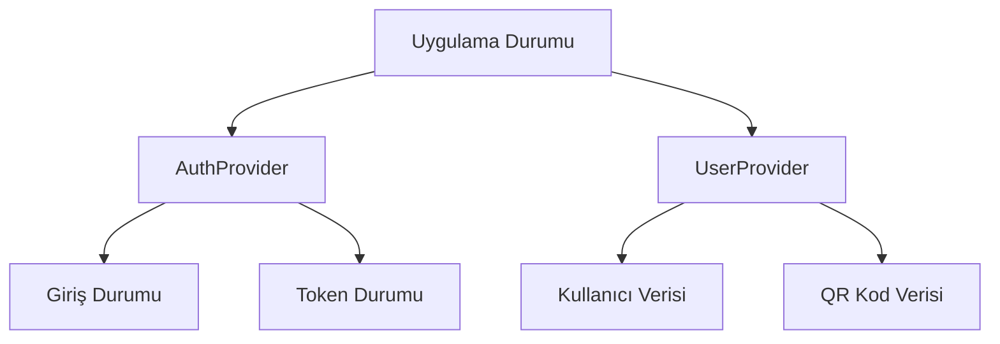
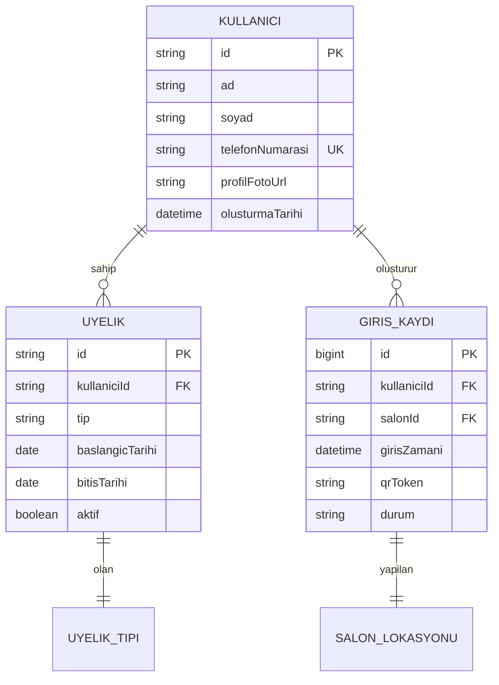
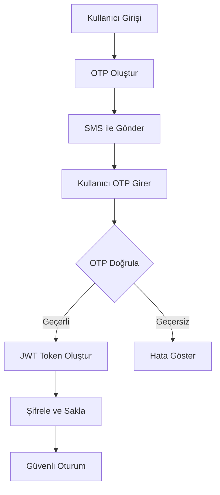

# GymPass QR Sistemi - Teknik Dokümantasyon

**Versiyon:** 1.0.0  
**Tarih:** Ocak 2025  
**Doküman Tipi:** Teknik Devir Teslim Dokümantasyonu  
**Dil:** Türkçe

---

## İçindekiler

1. [Proje Genel Bakış](#1-proje-genel-bakış)
2. [Sistem Mimarisi](#2-sistem-mimarisi)
3. [Proje Yapısı](#3-proje-yapısı)
4. [Veri Modelleri](#4-veri-modelleri)
5. [Temel Servisler](#5-temel-servisler)
6. [Kullanıcı Arayüzü Ekranları](#6-kullanıcı-arayüzü-ekranları)
7. [Kimlik Doğrulama Akışı](#7-kimlik-doğrulama-akışı)
8. [Durum Yönetimi](#8-durum-yönetimi)
9. [API Entegrasyonu](#9-api-entegrasyonu)
10. [Veritabanı Tasarımı](#10-veritabanı-tasarımı)
11. [Güvenlik Uygulaması](#11-güvenlik-uygulaması)
12. [Test Rehberi](#12-test-rehberi)
13. [Yayınlama Talimatları](#13-yayınlama-talimatları)
14. [Sorun Giderme](#14-sorun-giderme)
15. [Gelecek Geliştirmeler](#15-gelecek-geliştirmeler)

---

## 1. Proje Genel Bakış

### 1.1 GymPass QR Nedir?

GymPass QR, spor salonu üyelerinin tesise telefonlarındaki QR kodları kullanarak girmelerini sağlayan bir mobil uygulamadır. Fiziksel üyelik kartı taşımak yerine, kullanıcılar spor salonu girişindeki tarayıcıya telefon ekranlarındaki QR kodunu gösterebilirler.

### 1.2 Nasıl Çalışır?

1. **Kullanıcı uygulamayı açar**
2. **Telefon numarasını girer** (sadece ilk seferde)
3. **SMS kodu alır** doğrulama için
4. **Kodu girer** giriş yapmak için
5. **QR kodunu görür** ana ekranda
6. **QR kodunu gösterir** spor salonundaki tarayıcıya
7. **Tesise giriş yapar**

### 1.3 Temel Özellikler

- **Tek seferlik giriş:** Kullanıcılar her seferinde giriş yapmak zorunda değil
- **Otomatik QR yenileme:** QR kodları her 5 dakikada bir güncellenir ya da elle günceller
- **Çevrimdışı destek:** QR kodları internet olmadan da çalışır
- **Üyelik takibi:** Üyelik bitiş tarihini gösterir
- **Güvenli:** Şifreli tokenlar ve güvenli depolama kullanır

### 1.4 Teknoloji Yığını

| Bileşen | Teknoloji | Amaç |
|---------|-----------|------|
| Mobil Uygulama | Flutter | Çapraz platform geliştirme |
| Programlama Dili | Dart | Flutter için programlama dili |
| Durum Yönetimi | Provider | Uygulama durumunu yönetme |
| HTTP İstemcisi | Dio | API iletişimi |
| Depolama | Flutter Secure Storage | Tokenları güvenli saklama |
| QR Üretimi | qr_flutter | QR kod oluşturma |

---

## 2. Sistem Mimarisi

### 2.1 Üst Düzey Mimari Diyagramı



### 2.2 Bileşen Sorumlulukları

**Mobil Uygulama Bileşenleri:**

- **UI Katmanı:** Kullanıcıya ekranları gösterir
- **Durum Yönetimi:** Uygulamada veri akışını yönetir
- **Servisler:** İş mantığını işler
- **Depolama:** Verileri telefonda yerel olarak saklar

**Sunucu Tarafı Bileşenleri:**

- **API Sunucusu:** Uygulamadan gelen istekleri işler
- **Veritabanı:** Kullanıcı bilgilerini saklar
- **SMS Servisi:** Doğrulama kodlarını gönderir

**Donanım Bileşenleri:**

- **QR Tarayıcı:** QR kodlarını okur
- **Turnike:** Spor salonu girişindeki fiziksel kapı

---

## 3. Proje Yapısı

### 3.1 Klasör Organizasyonu

```
gym_pass_qr/
├── lib/                      # Ana kod dizini
│   ├── main.dart            # Uygulama giriş noktası
│   ├── app.dart             # Uygulama yapılandırması
│   │
│   ├── config/              # Yapılandırma dosyaları
│   │   ├── constants.dart   # Uygulama sabitleri
│   │   ├── routes.dart      # Navigasyon rotaları
│   │   └── theme.dart       # UI teması
│   │
│   ├── models/              # Veri modelleri
│   │   ├── user_model.dart  # Kullanıcı veri yapısı
│   │   └── auth_model.dart  # Kimlik doğrulama verisi
│   │
│   ├── services/            # İş mantığı
│   │   ├── api_service.dart # API iletişimi
│   │   ├── auth_service.dart # Kimlik doğrulama
│   │   └── storage_service.dart # Yerel depolama
│   │
│   ├── providers/           # Durum yönetimi
│   │   ├── auth_provider.dart # Kimlik durumu
│   │   └── user_provider.dart # Kullanıcı durumu
│   │
│   ├── screens/             # UI ekranları
│   │   ├── splash/          # Yükleme ekranı
│   │   ├── auth/            # Giriş ekranları
│   │   └── home/            # Ana ekran
│   │
│   ├── widgets/             # Yeniden kullanılabilir UI bileşenleri
│   │   └── common/          # Paylaşılan widgetlar
│   │
│   ├── utils/               # Yardımcı fonksiyonlar
│   │   ├── validators.dart  # Girdi doğrulama
│   │   └── logger.dart      # Loglama yardımcısı
│   │
│   └── mock/                # Test verileri
│       └── mock_data_service.dart # Sahte API
│
├── assets/                  # Resimler, fontlar, vb.
├── android/                 # Android-özel kod
├── ios/                     # iOS-özel kod
└── pubspec.yaml            # Bağımlılıklar
```

### 3.2 Dosya Amaçları

Her klasörün belirli bir amacı vardır:

- **config/**: Uygulamayı kontrol eden ayarlar
- **models/**: Verinin nasıl göründüğünü tanımlar
- **services/**: Karmaşık işlemleri yönetir
- **providers/**: Uygulama durumunu yönetir
- **screens/**: Kullanıcıların gördüğü ekranlar
- **widgets/**: Yeniden kullanılabilir UI parçaları
- **utils/**: Yardımcı araçlar
- **mock/**: Test için sahte veriler

---

## 4. Veri Modelleri

### 4.1 Kullanıcı Modeli

```dart
class User {
  String id;              // Benzersiz tanımlayıcı
  String firstName;       // Kullanıcının adı
  String lastName;        // Kullanıcının soyadı
  String phoneNumber;     // Giriş için telefon
  String? profilePhotoUrl; // İsteğe bağlı fotoğraf
  DateTime membershipStart; // Üyelik başlangıcı
  DateTime membershipEnd;   // Üyelik bitişi
  String membershipType;    // Temel/Standart/Premium
  bool isActive;           // Hesap durumu
}
```

### 4.2 Kimlik Doğrulama Modeli

```dart
class AuthResponse {
  String accessToken;    // API çağrıları için token
  String refreshToken;   // Yeni access token almak için
  int expiresIn;        // Saniye cinsinden süre
  User user;            // Kullanıcı bilgileri
}
```

### 4.3 QR Kod Modeli

```dart
class QrCodeData {
  String userId;         // Hangi kullanıcı
  String token;          // Benzersiz QR tokeni
  DateTime validUntil;   // QR'ın geçerlilik süresi
  Map metadata;          // Ekstra bilgiler
}
```

### 4.4 UML Sınıf Diyagramı



---

## 5. Temel Servisler

### 5.1 Kimlik Doğrulama Servisi

**Amaç:** Tüm giriş işlemlerini yönetir

**Ana Fonksiyonlar:**

- `otpGonder(telefonNumarasi)`: SMS kodu gönderir
- `otpDogrula(telefonNumarasi, kod)`: Kodun doğru olup olmadığını kontrol eder
- `cikisYap()`: Kullanıcı oturumunu temizler
- `tokenYenile()`: Süresi dolduğunda yeni token alır

**Nasıl çalışır:**

1. Kullanıcı telefon numarasını girer
2. Servis API'ye istek gönderir
3. API kullanıcıya SMS gönderir
4. Kullanıcı kodu girer
5. Servis kodu doğrular
6. Doğruysa, token ve kullanıcı verisini kaydeder

### 5.2 Depolama Servisi

**Amaç:** Verileri telefonda saklar

**Ana Fonksiyonlar:**

- `tokenKaydet(token)`: Giriş tokenını saklar
- `tokenAl()`: Saklanan tokenı alır
- `kullaniciKaydet(kullanici)`: Kullanıcı bilgilerini saklar
- `tumunuTemizle()`: Tüm saklanan verileri siler

**Güvenlik:** Hassas veriler için şifreli depolama kullanır

### 5.3 API Servisi

**Amaç:** Sunucu ile iletişim kurar

**Ana Fonksiyonlar:**

- `get(endpoint)`: Veri çeker
- `post(endpoint, veri)`: Veri gönderir
- Otomatik token ekleme
- Hata yönetimi
- Yeniden deneme mantığı

---

## 6. Kullanıcı Arayüzü Ekranları

### 6.1 Ekran Akış Diyagramı



### 6.2 Ekran Açıklamaları

#### Açılış Ekranı

- **Amaç:** Uygulama başlarken yükleme ekranı
- **Süre:** 2 saniye
- **İşlemler:** Kullanıcının giriş yapıp yapmadığını kontrol eder

#### Telefon Giriş Ekranı

- **Amaç:** Kullanıcı telefon numarasını girer
- **Doğrulama:** Telefon formatını kontrol eder
- **Sonraki:** OTP gönderir ve doğrulamaya gider

#### OTP Doğrulama Ekranı

- **Amaç:** Kullanıcı SMS kodunu girer
- **Özellikler:**
  - 30 saniyelik yeniden gönderme sayacı
  - 6 haneli kod girişi
  - Tamamlandığında otomatik gönderim

#### Ana Ekran

- **Amaç:** QR kodu ve kullanıcı bilgilerini gösterir
- **Özellikler:**
  - Kullanıcı profili görüntüleme
  - Üyelik durumu
  - Tarama için QR kodu
  - Yenileme butonu
  - Çıkış seçeneği

---

## 7. Kimlik Doğrulama Akışı

### 7.1 Sıralı Diyagram



### 7.2 Token Yönetimi

**Token Türleri:**

1. **Erişim Tokeni:** API çağrıları için kullanılır (1 saatte sona erer)
2. **Yenileme Tokeni:** Yeni erişim tokeni almak için kullanılır (30 günde sona erer)

**Token Akışı:**

1. Kullanıcı giriş yapar → Her iki tokeni alır
2. Erişim tokeni sona erer → Yenileme tokenini kullan
3. Yenileme tokeni sona erer → Kullanıcı tekrar giriş yapmalı

---

## 8. Durum Yönetimi

### 8.1 Provider Deseni

Uygulama durum yönetimi için Provider kullanır:



### 8.2 Durum Güncellemeleri

**AuthProvider yönetir:**

- Giriş durumu
- Kimlik doğrulama tokenları
- Yükleme durumları
- Hata mesajları

**UserProvider yönetir:**

- Kullanıcı profil verisi
- QR kod üretimi
- Üyelik bilgileri

---

## 9. API Entegrasyonu

### 9.1 API Uç Noktaları

| Metod | Uç Nokta | Amaç | Kimlik Doğrulama |
|-------|----------|------|-------------------|
| POST | `/auth/send-otp` | SMS kodu gönder | Hayır |
| POST | `/auth/verify-otp` | Kodu doğrula | Hayır |
| GET | `/user/profile` | Kullanıcı bilgisi al | Evet |
| POST | `/user/generate-qr` | QR kod oluştur | Evet |
| POST | `/auth/refresh` | Token yenile | Evet |

### 9.2 İstek/Yanıt Formatı

**OTP Gönderme İsteği:**

```json
{
  "phoneNumber": "+905551234567"
}
```

**OTP Gönderme Yanıtı:**

```json
{
  "success": true,
  "message": "OTP başarıyla gönderildi"
}
```

**OTP Doğrulama İsteği:**

```json
{
  "phoneNumber": "+905551234567",
  "code": "123456"
}
```

**OTP Doğrulama Yanıtı:**

```json
{
  "accessToken": "eyJhbGciOiJIUzI1NiIs...",
  "refreshToken": "eyJhbGciOiJIUzI1NiIs...",
  "expiresIn": 3600,
  "user": {
    "id": "user_001",
    "firstName": "Ahmet",
    "lastName": "Yılmaz",
    "membershipEnd": "2024-12-31"
  }
}
```

### 9.3 Hata Yönetimi

**Yaygın Hata Kodları:**

- `400`: Hatalı istek (geçersiz veri)
- `401`: Yetkisiz (token süresi dolmuş)
- `404`: Bulunamadı (kullanıcı mevcut değil)
- `500`: Sunucu hatası

---

## 10. Veritabanı Tasarımı

### 10.1 Varlık İlişki Diyagramı



### 10.2 Tablo Açıklamaları

**Kullanıcılar Tablosu:**

- Temel kullanıcı bilgilerini saklar
- Telefon numarası benzersiz tanımlayıcıdır
- Üyelik ve giriş kayıtlarına bağlanır

**Üyelikler Tablosu:**

- Üyelik dönemlerini takip eder
- Kullanıcı başına birden fazla kayıt olabilir
- Aynı anda sadece biri aktif

**Giriş Kayıtları Tablosu:**

- Her giriş denemesini kaydeder
- Analitik ve güvenlik için kullanılır
- Kullanım desenlerini takip etmeye yardımcı olur

---

## 11. Güvenlik Uygulaması

### 11.1 Güvenlik Önlemleri

1. **Token Güvenliği:**
   - Tokenlar şifreli depolamada saklanır
   - Otomatik süre sonu ve yenileme
   - HTTPS üzerinden güvenli iletim

2. **OTP Güvenliği:**
   - 6 haneli rastgele kodlar
   - 5 dakikalık geçerlilik süresi
   - Hız sınırlama (3 deneme)

3. **Veri Koruması:**
   - Depolama için AES-256 şifreleme
   - Ağ iletişimi için TLS 1.3
   - Loglarda hassas veri yok

### 11.2 Güvenlik Akış Diyagramı



---

## 12. Test Rehberi

### 12.1 Test Hesapları

Test için bu telefon numaralarını kullanın:

| Telefon Numarası | Kullanıcı Tipi | Açıklama |
|------------------|----------------|----------|
| +90 555 123 4567 | Premium | Aktif üyelik |
| +90 555 987 6543 | Standart | Yakında sona erecek |
| +90 555 555 5555 | Temel | Süresi dolmuş üyelik |

**Test OTP Kodu:** `123456` (tüm test hesapları için çalışır)

### 12.2 Test Senaryoları

1. **Yeni Kullanıcı Girişi:**
   - Telefon numarası gir
   - OTP gir
   - Ana ekranın göründüğünü doğrula

2. **Token Kalıcılığı:**
   - Bir kez giriş yap
   - Uygulamayı kapat
   - Uygulamayı tekrar aç
   - Doğrudan ana ekrana gitmeli

3. **QR Üretimi:**
   - Ana ekrana git
   - QR kodunun göründüğünü doğrula
   - Yenilemenin çalıştığını kontrol et

4. **Çıkış:**
   - Çıkış butonuna tıkla
   - İşlemi onayla
   - Giriş ekranına dönüşü doğrula

### 12.3 Mock Modu vs Gerçek API

**Mevcut Kurulum (Mock Modu):**

```dart
static const bool useMockData = true;
```

**Gerçek API Kullanmak İçin:**

```dart
static const bool useMockData = false;
static const String baseUrl = 'https://sizin-api.com';
```

---

## 13. Yayınlama Talimatları

### 13.1 Android Yayınlama

1. **Versiyonu güncelle** `pubspec.yaml` içinde:

   ```yaml
   version: 1.0.0+1
   ```

2. **APK oluştur:**

   ```bash
   flutter build apk --release
   ```

3. **App Bundle oluştur:**

   ```bash
   flutter build appbundle --release
   ```

4. **Çıktı konumu:**
   - APK: `build/app/outputs/flutter-apk/app-release.apk`
   - Bundle: `build/app/outputs/bundle/release/app-release.aab`

### 13.2 iOS Yayınlama

1. **Xcode'da aç:**

   ```bash
   open ios/Runner.xcworkspace
   ```

2. **İmzalamayı yapılandır:**
   - Takım seç
   - Bundle identifier ayarla

3. **Arşiv oluştur:**

   ```bash
   flutter build ios --release
   ```

4. **App Store'a yükle:**
   - Xcode organizer kullan
   - Veya Transporter uygulaması kullan

### 13.3 Ortam Yapılandırması

**Geliştirme:**

```dart
class DevConfig {
  static const String baseUrl = 'https://dev-api.com';
  static const bool enableLogging = true;
}
```

**Üretim:**

```dart
class ProdConfig {
  static const String baseUrl = 'https://api.com';
  static const bool enableLogging = false;
}
```

---

## 14. Sorun Giderme

### 14.1 Yaygın Sorunlar

| Sorun | Sebep | Çözüm |
|-------|-------|-------|
| Uygulama başlangıçta çöküyor | Eksik bağımlılıklar | `flutter pub get` çalıştır |
| OTP alamıyorum | Yanlış telefon formatı | Ülke kodunu kontrol et |
| QR üretilmiyor | API hatası | İnternet bağlantısını kontrol et |
| Token süresi doldu hatası | Eski token | Çıkış yap ve tekrar giriş yap |
| Build başarısız | Eski Flutter versiyonu | `flutter upgrade` çalıştır |

### 14.2 Debug İpuçları

1. **Loglamayı etkinleştir:**

   ```dart
   AppLogger.debug('Mesajınız burada');
   ```

2. **API yanıtlarını kontrol et:**
   - Dio interceptor kullan
   - Tüm istek/yanıtları logla

3. **Çevrimdışı test et:**
   - İnterneti kapat
   - Hata yönetimini kontrol et

### 14.3 Hata Mesajları

**Kullanıcı Dostu Mesajlar:**

- "Bir şeyler ters gitti" → Detaylar için logları kontrol et
- "Ağ hatası" → İnternet bağlantısı yok
- "Oturum süresi doldu" → Token yenilenmeli
- "Geçersiz kod" → Yanlış OTP girildi

---

## 15. Gelecek Geliştirmeler

### 15.1 Planlanan Özellikler

1. **Biyometrik Giriş:**
   - Parmak izi doğrulama
   - Yüz tanıma desteği

2. **Çoklu Spor Salonu:**
   - Salon lokasyonu seçimi
   - Lokasyon başına farklı QR

3. **Misafir Geçişleri:**
   - Geçici QR oluştur
   - Arkadaşlarla paylaş

4. **Ödeme Entegrasyonu:**
   - Uygulama içi üyelik yenileme
   - Ödeme geçmişi

5. **Analitik Panosu:**
   - Ziyaret sıklığı
   - Yoğun saatler
   - Kullanım istatistikleri

### 15.2 Kod İyileştirmeleri

1. **Unit Test Ekle:**

   ```dart
   test('Kullanıcı modeli ayrıştırma', () {
     final kullanici = User.fromJson(jsonVeri);
     expect(kullanici.firstName, 'Ahmet');
   });
   ```

2. **Önbellekleme Uygula:**
   - Kullanıcı verisini önbellekle
   - Çevrimdışı QR üretimi

3. **Animasyon Ekle:**
   - Ekran geçişleri
   - QR kod animasyonları

4. **Hata Yönetimini İyileştir:**
   - Spesifik hata tipleri
   - Kurtarma mekanizmaları

### 15.3 Performans Optimizasyonları

1. **API Çağrılarını Azalt:**
   - Yanıtları önbellekle
   - Toplu istekler

2. **Resimleri Optimize Et:**
   - WebP formatı kullan
   - Lazy loading

3. **Kod Bölme:**
   - Dinamik importlar
   - İlk yüklemeyi azalt

---

## Ek A: Bağımlılıklar

```yaml
dependencies:
  flutter:
    sdk: flutter
  provider: ^6.1.1          # Durum yönetimi
  dio: ^5.4.0              # HTTP istemcisi
  flutter_secure_storage: ^9.0.0  # Güvenli depolama
  shared_preferences: ^2.2.2       # Normal depolama
  qr_flutter: ^4.1.0       # QR üretimi
  go_router: ^13.0.0       # Navigasyon
  pin_code_fields: ^8.0.1 # OTP girişi
  intl_phone_field: ^3.2.0 # Telefon girişi
```

## Ek B: Proje Komutları

```bash
# Bağımlılıkları yükle
flutter pub get

# Uygulamayı çalıştır
flutter run

# Belirli cihazda çalıştır
flutter run -d device_id

# APK oluştur
flutter build apk

# Projeyi temizle
flutter clean

# Bağımlılıkları güncelle
flutter pub upgrade

# İkon oluştur
flutter pub run flutter_launcher_icons:main

# Testleri çalıştır
flutter test
```

## Ek C: İletişim Bilgileri

**Geliştirme Takımı:**

- Proje Lideri: [İsim]
- Mobil Geliştirici: [İsim]
- Backend Geliştirici: [İsim]

**Destek:**

- E-posta: <destek@gympass.com>
- Dokümantasyon: Bu doküman
- Depo: [Git URL]

---

**Doküman Versiyon Geçmişi:**

- v1.0.0 (Ocak 2025): İlk dokümantasyon

**Doküman Sonu**
